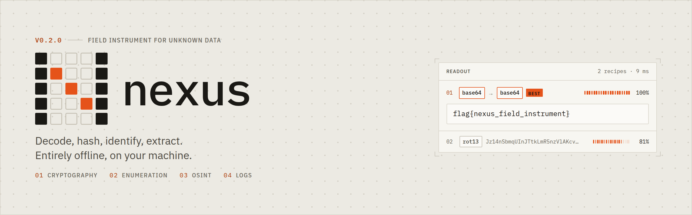
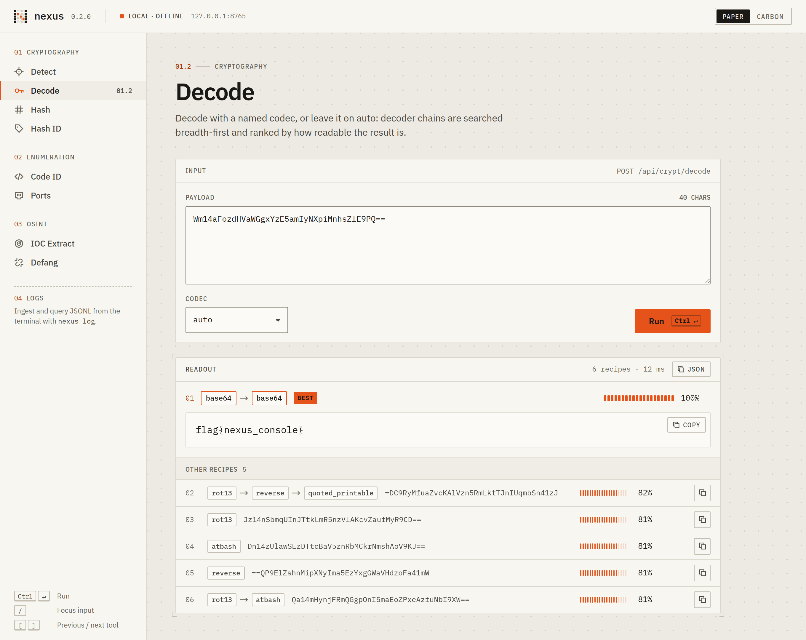
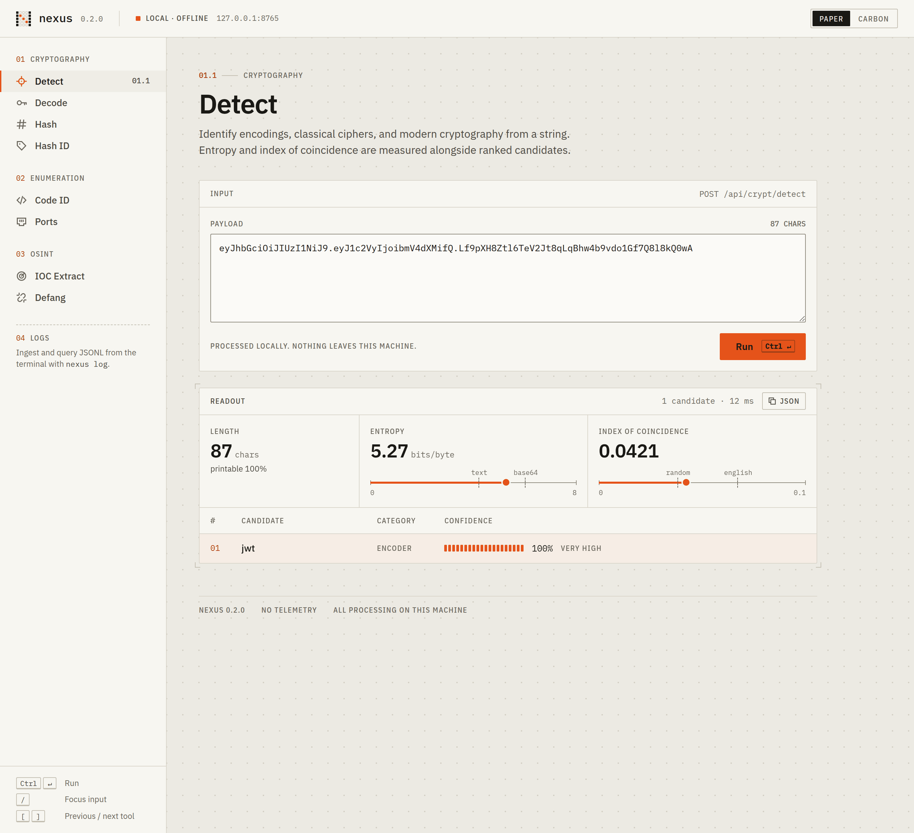
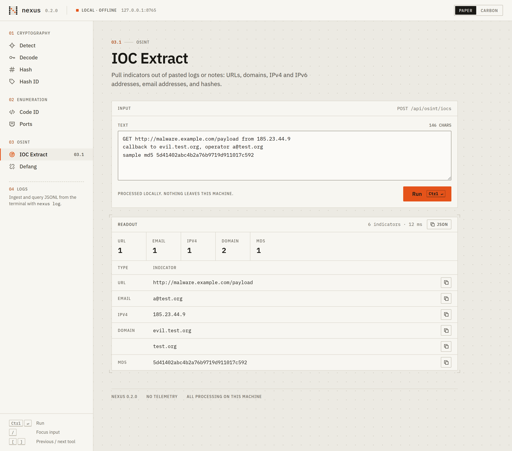
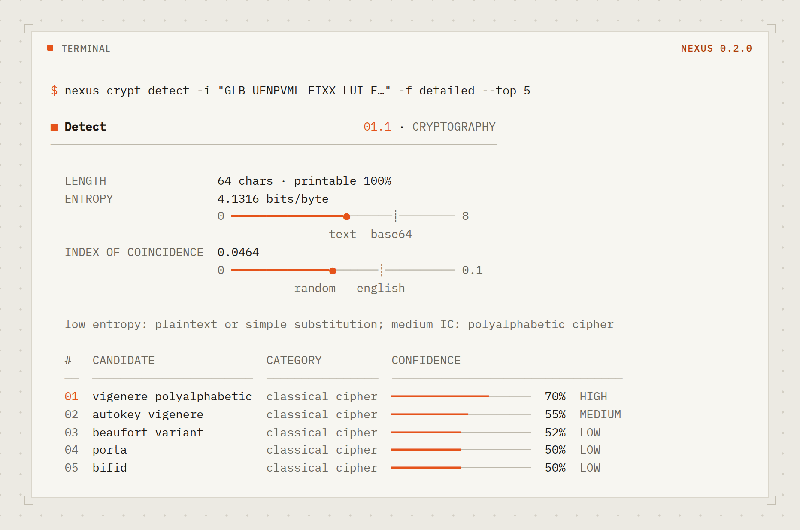
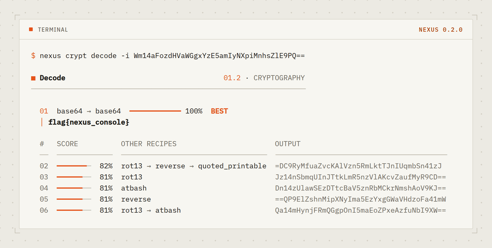
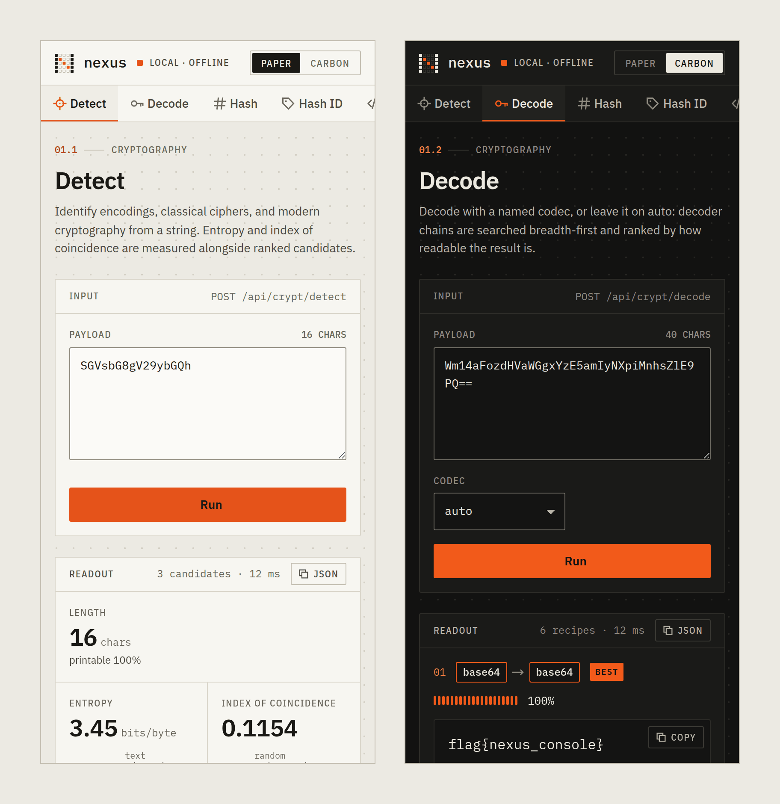

<picture>
  <source media="(prefers-color-scheme: dark)" srcset="assets/brand/banner-carbon.png">
  
</picture>

<div align="center">

[](https://www.python.org/)
[](LICENSE)
[](#requirements)
[](#privacy)

</div>

Nexus bundles the small analysis tasks that come up constantly in CTFs, incident
triage, and reverse engineering into one CLI and one offline web console: figure
out what an unknown blob is, decode it, hash it, identify a hash, pull indicators
out of a file, look up a port, and slice JSONL logs with SQL. Everything runs on
your machine against data you already have.

## Screenshots

Screenshots follow your GitHub theme: Paper in light mode, Carbon in dark mode.

<picture>
  <source media="(prefers-color-scheme: dark)" srcset="assets/screens/web-decode-carbon.png">
  
</picture>

<table>
<tr>
<td width="50%">
<picture>
  <source media="(prefers-color-scheme: dark)" srcset="assets/screens/web-detect-carbon.png">
  
</picture>
<p align="center"><sub><b>01.1 Detect</b> · entropy and IC gauges with reference markers</sub></p>
</td>
<td width="50%">
<picture>
  <source media="(prefers-color-scheme: dark)" srcset="assets/screens/web-iocs-carbon.png">
  
</picture>
<p align="center"><sub><b>03.1 IOC Extract</b> · tally and grouped indicators</sub></p>
</td>
</tr>
<tr>
<td width="50%">
<picture>
  <source media="(prefers-color-scheme: dark)" srcset="assets/screens/cli-detect-carbon.png">
  
</picture>
<p align="center"><sub><code>nexus crypt detect -f detailed</code></sub></p>
</td>
<td width="50%">
<picture>
  <source media="(prefers-color-scheme: dark)" srcset="assets/screens/cli-decode-carbon.png">
  
</picture>
<p align="center"><sub><code>nexus crypt decode</code> (auto)</sub></p>
</td>
</tr>
</table>

## Features

| Module | Command | What it does |
|--------|---------|--------------|
| **Cryptography** | `crypt detect` | Identify encodings, classical ciphers, and modern crypto from a string, with entropy, printable ratio, and index of coincidence. |
| | `crypt decode` | Decode with a named codec, or `auto` mode recursively searches decoder chains and ranks results by readability. |
| | `crypt hash` | Compute md5, sha1/2/3, blake2, and crc32 of a string or file. |
| | `crypt hash-id` | Identify the likely algorithm of a hash by format, length, and charset. |
| **Enumeration** | `enum code-id` | Identify the programming language of a code snippet (14 languages). |
| | `enum file-id` | Identify a file's language from extension, shebang, and content. |
| | `enum ports` | Offline lookup of well-known ports by number or service name. |
| **OSINT** | `osint meta` | Extract EXIF, GPS, hashes, and file metadata from images. |
| | `osint strings` | Extract printable strings and classify IOCs (URLs, IPs, domains, emails, hashes). |
| | `osint defang` / `refang` | Neutralize indicators for safe sharing, and restore them. |
| **Logs** | `log ingest` | Ingest JSONL into a local DuckDB-backed table. |
| | `log canned` | Run built-in analytics (counts, top values, status codes, histograms, errors). |
| | `log query` | Run read-only SELECT/WITH queries against ingested data. |
| | `log info` | Show ingested datasets and the active table schema. |
| **Web UI** | `serve` | A single-page console over every text tool, served from loopback. |

## Requirements

- Python 3.11 or newer
- Linux, macOS, or Windows

## Install

<details open>
<summary><b>Debian / Ubuntu / Kali</b></summary>

```bash
sudo apt update && sudo apt install -y pipx
pipx ensurepath
pipx install nexus-tool
```
</details>

<details>
<summary><b>Arch</b></summary>

```bash
sudo pacman -S --needed python-pipx
pipx ensurepath
pipx install nexus-tool
```
</details>

<details>
<summary><b>Windows</b></summary>

```powershell
py -m pip install --user -U nexus-tool
```
</details>

Open a new shell after `pipx ensurepath` so the PATH change takes effect.

## Quick start

```bash
nexus crypt detect -i "SGVsbG8gV29ybGQh"      # what is this string?
nexus crypt decode -i "Uryyb Jbeyq" -c auto   # let it find the recipe
nexus crypt hash-id -i "5d41402abc4b2a76b9719d911017c592"
nexus enum ports 445
nexus osint defang -i "http://evil.example.com"
nexus serve                                   # open the web console
```

## Usage

### Cryptography

```bash
# Detect (simple, detailed, compact, or json output)
nexus crypt detect -i "SGVsbG8gV29ybGQh"
nexus crypt detect -i "URYYB JBEYQ" -f detailed
nexus crypt detect -i "c2NyaWJibGU=" -f json --top 5

# Decode with a specific codec (see `nexus crypt codecs` for the full list)
nexus crypt decode -i "SGVsbG8=" -c base64
nexus crypt decode -i "Khoor" -c caesar --shift 3

# Auto mode: recursively try decoder chains, ranked by readability
nexus crypt decode -i "Wm14aFozdHVaWGgxYzMwPQ==" -c auto

# Hash a string or a file, and identify an unknown hash
nexus crypt hash -i "password123"
nexus crypt hash -f ./firmware.bin
nexus crypt hash-id -i "$2b$12$R9h/cIPz0gi.URNNX3kh2O..."
```

### Enumeration

```bash
nexus enum code-id -i "def hello(): print('hi')"
nexus enum file-id -i ./unknown_script
nexus enum ports 443        # by number
nexus enum ports redis      # by service name
```

### OSINT

```bash
nexus osint meta -i ./photo.jpg               # EXIF + GPS + hashes
nexus osint strings -i ./sample.bin           # extract and classify IOCs
nexus osint defang -i "visit http://1.2.3.4"  # -> hxxp[://]1[.]2[.]3[.]4
nexus osint refang -i "hxxp[://]1[.]2[.]3[.]4"
```

### Logs

```bash
nexus log ingest -i ./events.jsonl
nexus log canned                              # list built-in queries
nexus log canned status_codes
nexus log canned top_values --params '{"field":"path","limit":10}'
nexus log query "SELECT method, COUNT(*) c FROM events GROUP BY method ORDER BY c DESC"
nexus log info
```

Any command accepts `--json` (or `-f json` for `crypt detect`) for machine-readable
output that pipes cleanly into `jq` and scripts.

## Web UI

```bash
nexus serve                 # http://127.0.0.1:8765, opens a browser
nexus serve --port 9000 --no-open
```

The console exposes every text-based tool through a browser. It binds to loopback
by default and makes no outbound requests, so it is safe to run on an analysis box.

| Key | Action |
|-----|--------|
| <kbd>Ctrl</kbd> / <kbd>⌘</kbd> + <kbd>Enter</kbd> | Run the current tool |
| <kbd>/</kbd> | Focus the input |
| <kbd>[</kbd> <kbd>]</kbd> | Previous / next tool |

Every tool has sample specimens in its empty state, a Copy action on each result,
and a Paper / Carbon theme switch that follows your system setting until you pick
one. The layout is responsive down to phone width.

> [!NOTE]
> The web UI covers text operations. File-based tools (`osint meta`, `osint strings`,
> `log ingest`) remain CLI-only, since they read files from your machine.

<details>
<summary>Mobile layout</summary>
<br>


</details>

## Design

Nexus uses one visual system across the web console, the terminal, and the docs,
called **Field Instrument**: quiet surfaces, precise type, and a single signal color,
so the readout is the loudest thing on screen.

| | |
|---|---|
| **Mark** | A Polybius square (5×5 cipher grid) whose filled cells spell **N**; the diagonal carries the signal color |
| **Type** | IBM Plex Sans, Plex Mono, and Plex Sans Condensed, bundled locally (OFL) |
| **Color** | Paper and Carbon neutrals with signal orange; text clears 4.5:1 and controls clear 3:1 in both themes |
| **Instruments** | 20-cell segmented meters and reference-marked gauges, mirrored in CLI output |

See [docs/DESIGN.md](docs/DESIGN.md) for tokens and rules.

## Output formats (`crypt detect`)

| Format | Description |
|--------|-------------|
| `simple` | Top match with a confidence rating (default) |
| `detailed` | Full entropy and IC analysis with ranked candidates |
| `compact` | Table view for quick scanning |
| `json` | Raw JSON for scripting and piping |

## Privacy

Nexus performs all analysis locally. It opens no network sockets except the
loopback listener you explicitly start with `nexus serve`. Nothing is uploaded,
and there is no telemetry.

## Data and storage

Nexus reads an optional config from `~/.nexus/config.toml` (override with
`--config`) and writes only under `~/.nexus/`:

- `audit.log` - one JSON line per command (module, action, target, timestamp)
- `duckdb/nexus.duckdb` and `parquet/` - ingested log datasets

Delete `~/.nexus/` at any time to clear all local state.

```toml
# ~/.nexus/config.toml
[data]
data_dir = "~/.nexus"
audit_log = "~/.nexus/audit.log"

[log]
default_table_name = "events"
```

## Project structure

```
src/nexus/
├── cli.py                 # entry point: loads config, registers module groups
├── core/
│   ├── config.py          # TOML config loading
│   ├── audit.py           # append-only JSONL audit log
│   ├── storage.py         # DuckDB connection
│   └── render.py          # terminal design system: meters, scales, tables, mark
├── modules/
│   ├── cryptography/      # detect, decode + magic, hashing
│   ├── enumeration/       # code-id, file-id, ports
│   ├── osint/             # exif metadata, IOC extraction, defang
│   └── log_analysis/      # ingest, canned queries, SQL, info
└── web/
    ├── server.py          # stdlib HTTP server and JSON API
    └── static/            # console: index.html, style.css, app.js, fonts/
assets/
├── brand/                 # banners, social preview, mark (SVG)
└── screens/               # README screenshots (generated)
scripts/make_assets.py     # regenerates everything in assets/
```

Each module keeps its logic in `service.py` / helper files and its CLI surface in
`commands.py`, so the top-level `cli.py` stays thin.

## Development

```bash
git clone https://github.com/H4ch1Net/Nexus.git
cd Nexus
pip install -e ".[dev]"
pytest
```

The suite covers every module, the web API, and the CLI.

Screenshots, banners, and the social preview are generated from the running
product, so they stay in sync with the UI:

```bash
pip install -e ".[docs]"
python scripts/make_assets.py   # set CHROMIUM_PATH to use a specific Chromium build
```

Set `NEXUS_FORCE_COLOR=1` to keep CLI colors when piping (for example into
`less -R`); `NO_COLOR` always disables them.

## Troubleshooting

| Symptom | Fix |
|---------|-----|
| `nexus: command not found` after install | Run `pipx ensurepath` and open a new shell. |
| `log` commands fail importing pandas | Ensure `python-dateutil` is installed (a pandas dependency); reinstall with `pipx reinstall nexus-tool`. |
| `serve` cannot bind the port | Pass `--port` with a free port. |

## License

MIT. See [LICENSE](LICENSE).
