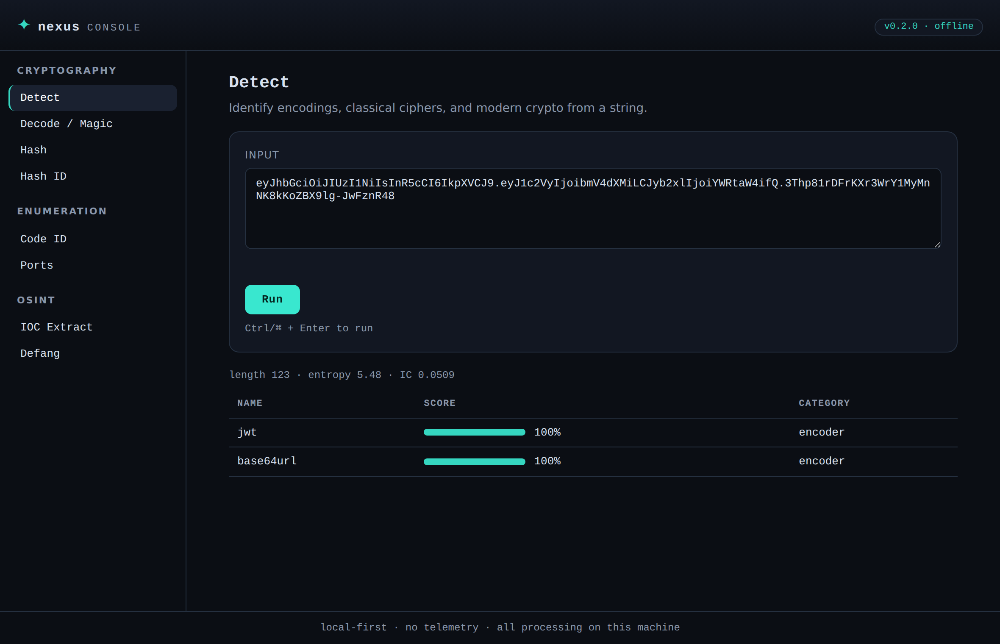
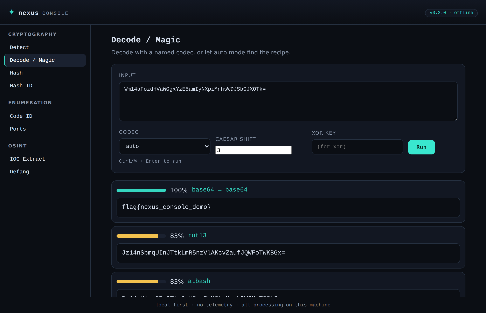
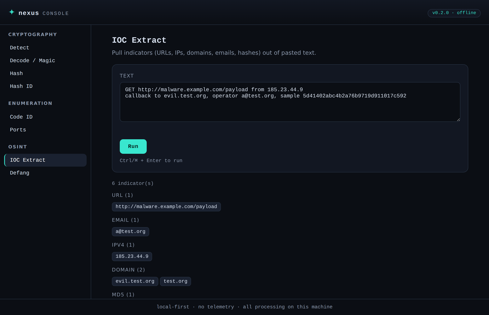
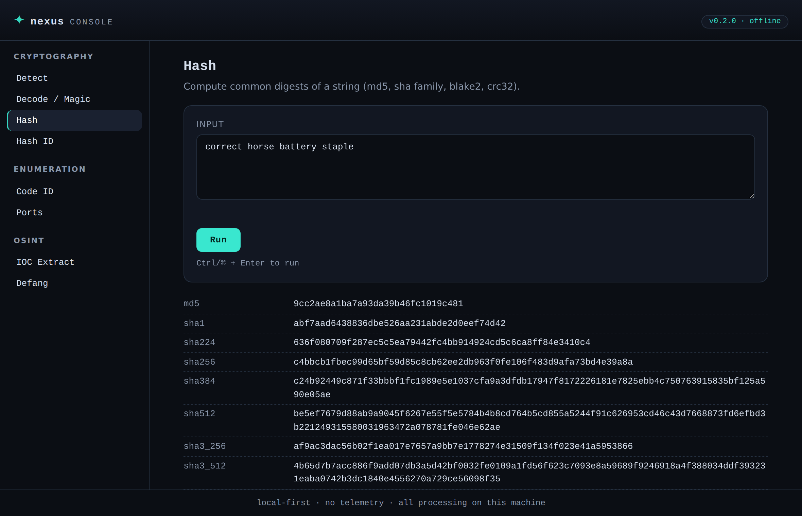
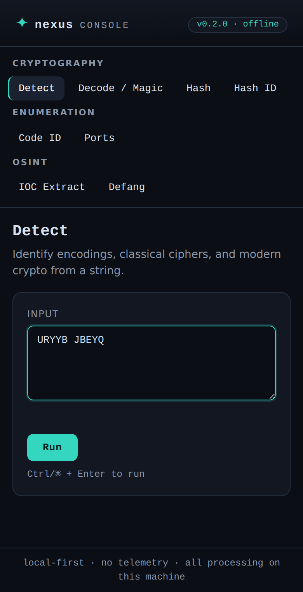

<div align="center">

# ✦ Nexus

**A local-first terminal toolkit for cryptography, OSINT, log analytics, and code enumeration.**

Runs entirely offline. No accounts, no telemetry, no outbound requests.

[](https://www.python.org/)
[](LICENSE)
[](#requirements)
[](#privacy)

</div>

Nexus bundles the small analysis tasks that come up constantly in CTFs, incident
triage, and reverse engineering into one CLI and one offline web console: figure
out what an unknown blob is, decode it, hash it, identify a hash, pull indicators
out of a file, look up a port, and slice JSONL logs with SQL. Everything runs on
your machine against data you already have.

## Screenshots

<div align="center">






</div>

## Features

| Module | Command | What it does |
|--------|---------|--------------|
| **Cryptography** | `crypt detect` | Identify encodings, classical ciphers, and modern crypto from a string, with entropy, printable ratio, and index of coincidence. |
| | `crypt decode` | Decode with a named codec, or `auto` mode recursively searches decoder chains and ranks results by readability. |
| | `crypt hash` | Compute md5, sha1/2/3, blake2, and crc32 of a string or file. |
| | `crypt hash-id` | Identify the likely algorithm of a hash by format, length, and charset. |
| **Enumeration** | `enum code-id` | Identify the programming language of a code snippet (14 languages). |
| | `enum file-id` | Identify a file's language from extension, shebang, and content. |
| | `enum ports` | Offline lookup of well-known ports by number or service name. |
| **OSINT** | `osint meta` | Extract EXIF, GPS, hashes, and file metadata from images. |
| | `osint strings` | Extract printable strings and classify IOCs (URLs, IPs, domains, emails, hashes). |
| | `osint defang` / `refang` | Neutralize indicators for safe sharing, and restore them. |
| **Logs** | `log ingest` | Ingest JSONL into a local DuckDB-backed table. |
| | `log canned` | Run built-in analytics (counts, top values, status codes, histograms, errors). |
| | `log query` | Run read-only SELECT/WITH queries against ingested data. |
| | `log info` | Show ingested datasets and the active table schema. |
| **Web UI** | `serve` | A single-page console over every text tool, served from loopback. |

## Requirements

- Python 3.11 or newer
- Linux, macOS, or Windows

## Install

<details open>
<summary><b>Debian / Ubuntu / Kali</b></summary>

```bash
sudo apt update && sudo apt install -y pipx
pipx ensurepath
pipx install nexus-tool
```
</details>

<details>
<summary><b>Arch</b></summary>

```bash
sudo pacman -S --needed python-pipx
pipx ensurepath
pipx install nexus-tool
```
</details>

<details>
<summary><b>Windows</b></summary>

```powershell
py -m pip install --user -U nexus-tool
```
</details>

Open a new shell after `pipx ensurepath` so the PATH change takes effect.

## Quick start

```bash
nexus crypt detect -i "SGVsbG8gV29ybGQh"      # what is this string?
nexus crypt decode -i "Uryyb Jbeyq" -c auto   # let it find the recipe
nexus crypt hash-id -i "5d41402abc4b2a76b9719d911017c592"
nexus enum ports 445
nexus osint defang -i "http://evil.example.com"
nexus serve                                   # open the web console
```

## Usage

### Cryptography

```bash
# Detect (simple, detailed, compact, or json output)
nexus crypt detect -i "SGVsbG8gV29ybGQh"
nexus crypt detect -i "URYYB JBEYQ" -f detailed
nexus crypt detect -i "c2NyaWJibGU=" -f json --top 5

# Decode with a specific codec (see `nexus crypt codecs` for the full list)
nexus crypt decode -i "SGVsbG8=" -c base64
nexus crypt decode -i "Khoor" -c caesar --shift 3

# Auto mode: recursively try decoder chains, ranked by readability
nexus crypt decode -i "Wm14aFozdHVaWGgxYzMwPQ==" -c auto

# Hash a string or a file, and identify an unknown hash
nexus crypt hash -i "password123"
nexus crypt hash -f ./firmware.bin
nexus crypt hash-id -i "$2b$12$R9h/cIPz0gi.URNNX3kh2O..."
```

### Enumeration

```bash
nexus enum code-id -i "def hello(): print('hi')"
nexus enum file-id -i ./unknown_script
nexus enum ports 443        # by number
nexus enum ports redis      # by service name
```

### OSINT

```bash
nexus osint meta -i ./photo.jpg               # EXIF + GPS + hashes
nexus osint strings -i ./sample.bin           # extract and classify IOCs
nexus osint defang -i "visit http://1.2.3.4"  # -> hxxp[://]1[.]2[.]3[.]4
nexus osint refang -i "hxxp[://]1[.]2[.]3[.]4"
```

### Logs

```bash
nexus log ingest -i ./events.jsonl
nexus log canned                              # list built-in queries
nexus log canned status_codes
nexus log canned top_values --params '{"field":"path","limit":10}'
nexus log query "SELECT method, COUNT(*) c FROM events GROUP BY method ORDER BY c DESC"
nexus log info
```

Any command accepts `--json` (or `-f json` for `crypt detect`) for machine-readable
output that pipes cleanly into `jq` and scripts.

## Web UI

```bash
nexus serve                 # http://127.0.0.1:8765, opens a browser
nexus serve --port 9000 --no-open
```

The console exposes every text-based tool through a browser. It binds to loopback
by default and makes no outbound requests, so it is safe to run on an analysis box.

The layout is responsive and works on a phone-width screen.

> [!NOTE]
> The web UI covers text operations. File-based tools (`osint meta`, `osint strings`,
> `log ingest`) remain CLI-only, since they read files from your machine.

<details>
<summary>Mobile layout</summary>



</details>

## Output formats (`crypt detect`)

| Format | Description |
|--------|-------------|
| `simple` | Top match with a confidence rating (default) |
| `detailed` | Full entropy and IC analysis with ranked candidates |
| `compact` | Table view for quick scanning |
| `json` | Raw JSON for scripting and piping |

## Privacy

Nexus performs all analysis locally. It opens no network sockets except the
loopback listener you explicitly start with `nexus serve`. Nothing is uploaded,
and there is no telemetry.

## Data and storage

Nexus reads an optional config from `~/.nexus/config.toml` (override with
`--config`) and writes only under `~/.nexus/`:

- `audit.log` - one JSON line per command (module, action, target, timestamp)
- `duckdb/nexus.duckdb` and `parquet/` - ingested log datasets

Delete `~/.nexus/` at any time to clear all local state.

```toml
# ~/.nexus/config.toml
[data]
data_dir = "~/.nexus"
audit_log = "~/.nexus/audit.log"

[log]
default_table_name = "events"
```

## Project structure

```
src/nexus/
├── cli.py                 # entry point: loads config, registers module groups
├── core/
│   ├── config.py          # TOML config loading
│   ├── audit.py           # append-only JSONL audit log
│   ├── storage.py         # DuckDB connection
│   └── render.py          # shared color/table/bar output helpers
├── modules/
│   ├── cryptography/      # detect, decode + magic, hashing
│   ├── enumeration/       # code-id, file-id, ports
│   ├── osint/             # exif metadata, IOC extraction, defang
│   └── log_analysis/      # ingest, canned queries, SQL, info
└── web/                   # stdlib server + single-page console
```

Each module keeps its logic in `service.py` / helper files and its CLI surface in
`commands.py`, so the top-level `cli.py` stays thin.

## Development

```bash
git clone https://github.com/H4ch1Net/Nexus.git
cd Nexus
pip install -e ".[dev]"
pytest
```

The suite covers every module, the web API, and the CLI.

## Troubleshooting

| Symptom | Fix |
|---------|-----|
| `nexus: command not found` after install | Run `pipx ensurepath` and open a new shell. |
| `log` commands fail importing pandas | Ensure `python-dateutil` is installed (a pandas dependency); reinstall with `pipx reinstall nexus-tool`. |
| `serve` cannot bind the port | Pass `--port` with a free port. |

## License

MIT. See [LICENSE](LICENSE).
